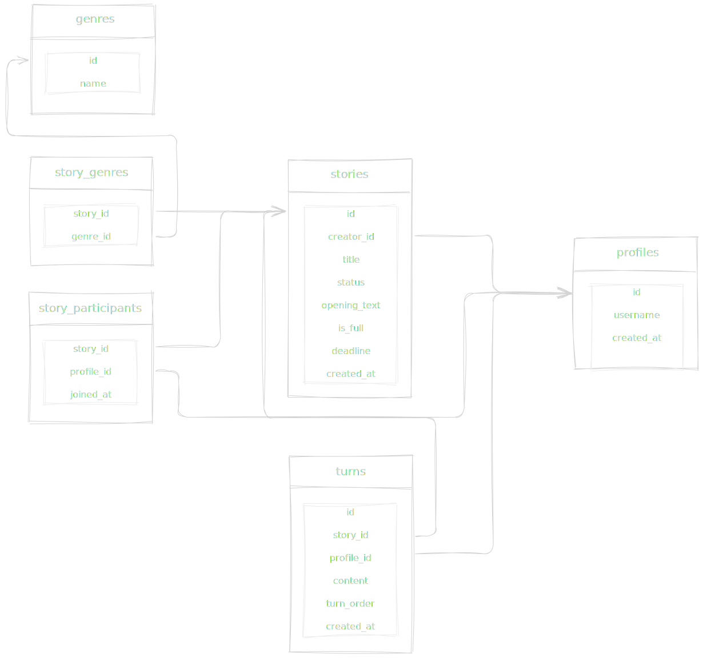

# Crowdtale ✒️

_Find someone. Start a story. See where it goes._

Crowdtale is an app for collaborative storytelling. You open the feed, find a story opening you like, join it, and continue the story together with other writers, taking turns.Instead of staring at a blank page, writing becomes a shared process. One person starts a story, someone else continues it, and the narrative slowly grows piece by piece. The app keeps things fair with a turn-based system and deadlines, so stories don’t get abandoned halfway through.

## Features

### Genre-based feed

Browse story openings by genre and join the ones that match your interests.

### Turn-based writing

Each participant writes one turn at a time, so everyone gets a chance to shape the story.

### Automatic story completion

If someone misses their deadline, the system automatically wraps up the story so it doesn’t stay unfinished forever.

## Tech stack:

- React + TypeScript

- TailwindCSS

- shadcn/ui

- TanStack Query + TanStack Virtual

- Supabase

- PostgreSQL

## Backend Design

The database is designed with relational structure in mind rather than a simple document-style schema.

### Key ideas:

- relational data model for users, stories, and turns
- PostgreSQL functions and triggers for enforcing turn order
- automated story completion using scheduled jobs
- server-side logic handled directly in the database where appropriate

### Database Schema

## Future Plans

### Realtime updates

Live updates for turns and story activity so participants can see new additions immediately without refreshing the page.

### Friends system

Ability to add friends and easily start stories with people you already enjoy writing with.

### Media tools for collaboration

Support for richer communication during stories, such as sharing images or using a small collaborative drawing canvas.

### More story settings

Additional options for story creation, such as participant limits, custom deadlines, and more control over how turns are handled.
